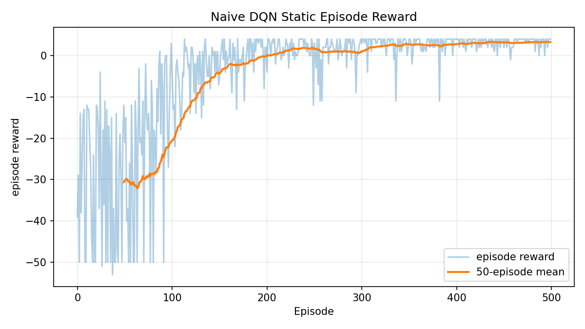
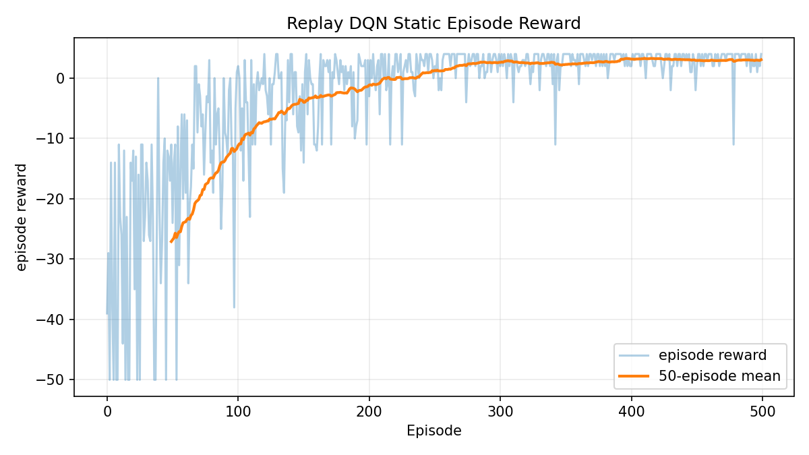
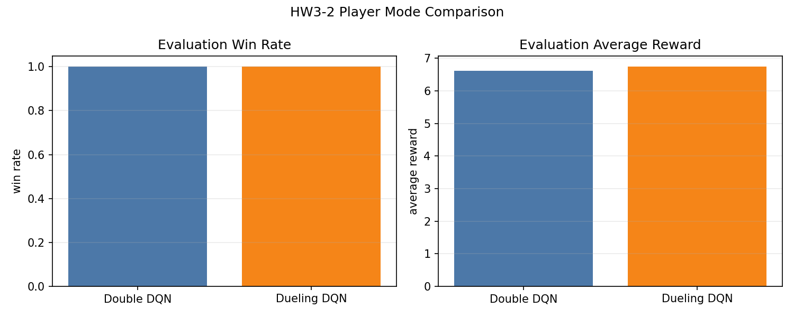
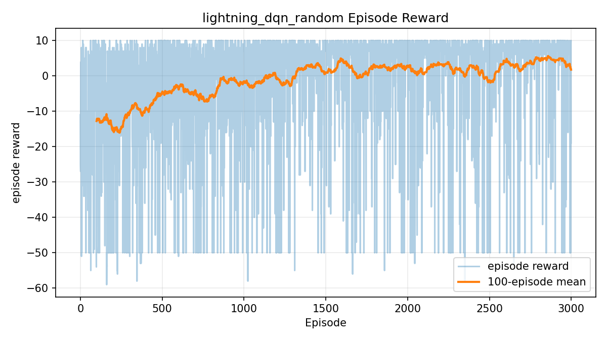
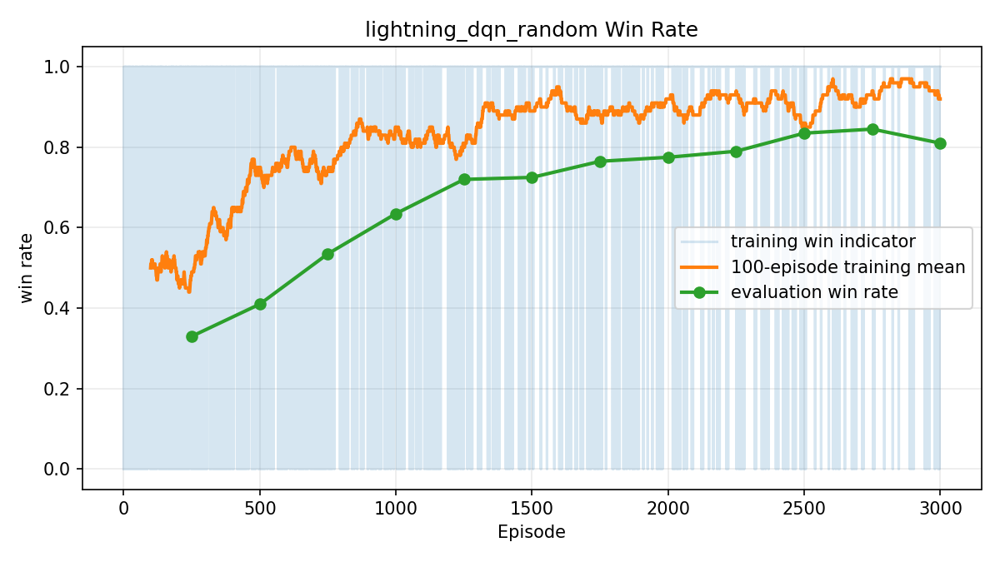
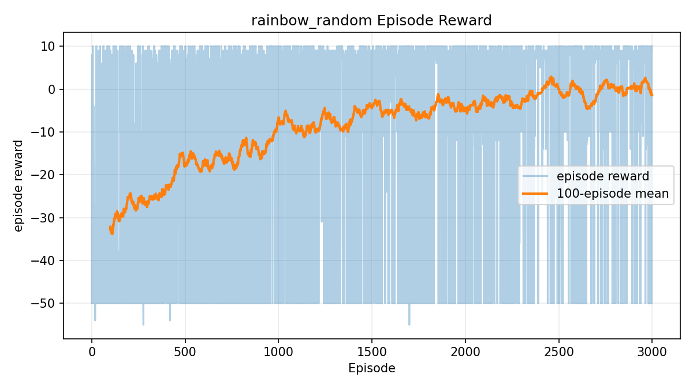
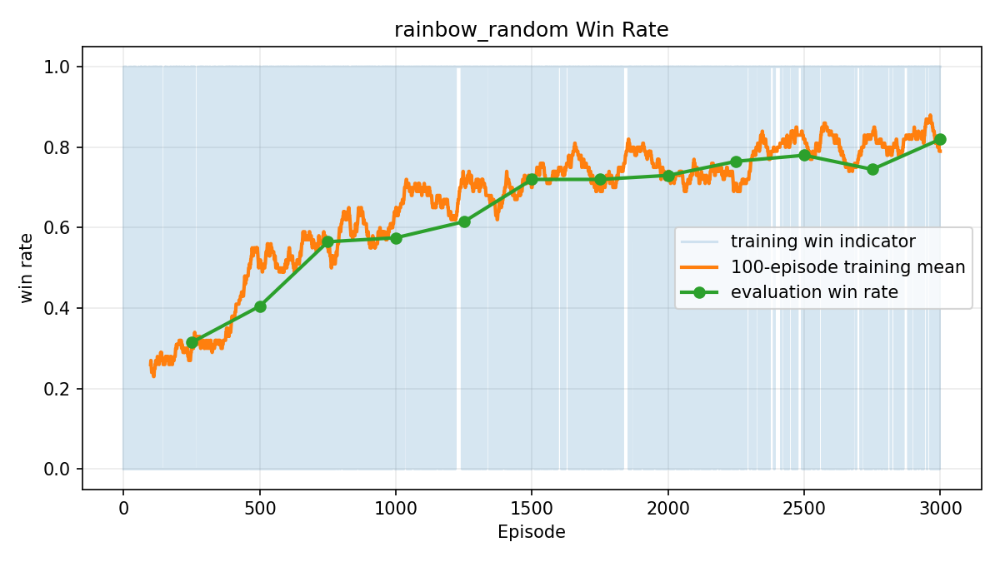

# DRL-HW3：GridWorld DQN 系列實作報告

本專案完成 DRL in Action Chapter 3 的 4x4 GridWorld 強化學習作業，依序實作與分析四個題目：

1. **HW3-1**：Static mode 的 Naive DQN 與 Replay Buffer DQN。
2. **HW3-2**：Player mode 的 Double DQN 與 Dueling DQN 比較。
3. **HW3-3**：Random mode 的 PyTorch Lightning Dueling Double DQN 與 training tips。
4. **HW3-4 Bonus**：Random mode 的 Rainbow DQN 加分題。

完整細節請見 `reports/`；本 README 摘要每題的核心方法、結果與代表性圖表。

---

## 專案結構

| 路徑 | 說明 |
| --- | --- |
| `reference/` | 原始 DRL in Action GridWorld 參考程式，保留未改。 |
| `src/gridworld.py`, `src/gridboard.py` | 整理後可 import 的 GridWorld 環境。 |
| `src/models.py` | DQN、Dueling DQN 等 PyTorch 模型。 |
| `src/dqn_training.py` | Double DQN / Dueling DQN 共用訓練流程。 |
| `src/replay_buffer.py` | Experience replay buffer。 |
| `src/rainbow.py` | Rainbow DQN components：PER、n-step、NoisyNet、C51 等。 |
| `scripts/` | 各題訓練與比較腳本。 |
| `reports/` | 四題完整文字報告。 |
| `results/logs/` | 訓練 summary JSON。 |
| `results/figures/` | loss、reward、win rate 與比較圖。 |
| `results/models/` | 訓練後模型權重。 |

---

## GridWorld 任務摘要

- 棋盤大小：`4 x 4`
- State：四個 one-hot layers，shape 為 `(4, 4, 4)`，訓練時 flatten 成 `(1, 64)`。
- Actions：`0=u`、`1=d`、`2=l`、`3=r`。
- Rewards：Goal `+10`、Pit `-10`、一般移動 `-1`。

| Mode | 隨機性 | 難度 |
| --- | --- | --- |
| `static` | Player、Goal、Pit、Wall 全固定 | 最簡單，近似記住固定最佳路徑。 |
| `player` | 只有 Player 起點隨機 | 中等，需要從不同起點到固定 Goal。 |
| `random` | Player、Goal、Pit、Wall 全部隨機 | 最難，需要泛化到不同 layout。 |

---

## HW3-1：Static Mode Naive DQN 與 Replay Buffer DQN

完整報告：[`reports/HW3-1_understanding_report.md`](reports/HW3-1_understanding_report.md)

### HW3-1 重點

HW3-1 使用 `static` mode 檢查 DQN 是否能在固定地圖中學到穩定策略。模型使用 MLP：

```text
Linear(64, 164) -> ReLU -> Linear(164, 164) -> ReLU -> Linear(164, 4)
```

本題比較兩種版本：

- **Naive DQN**：每一步直接用目前網路 bootstrap 下一狀態最大 Q-value。
- **DQN + Replay Buffer**：將 `(state, action, reward, next_state, done)` 存入 buffer，隨機抽 mini-batch 更新，降低樣本相關性並提升穩定度。

### HW3-1 結果摘要

| 方法 | Episodes | Eval win rate | Eval avg reward | Eval avg steps | Training time |
| --- | ---: | ---: | ---: | ---: | ---: |
| Naive DQN | 500 | 1.00 | 4.00 | 7.00 | 10.81 秒 |
| DQN + Replay Buffer | 500 | 1.00 | 4.00 | 7.00 | 12.05 秒 |

`static` mode 的最佳路徑固定，因此兩種方法都能快速達到 `1.00` win rate。平均 reward `4.00` 對應約 7 steps 到達 Goal：前 6 步各 `-1`，最後到 Goal 得 `+10`。





---

## HW3-2：Player Mode Double DQN vs. Dueling DQN

完整報告：[`reports/HW3-2_double_dueling_comparison.md`](reports/HW3-2_double_dueling_comparison.md)

### HW3-2 重點

HW3-2 進入 `player` mode：Goal、Pit、Wall 固定，但 Player 起點隨機。此設定比 HW3-1 更需要模型從不同起點泛化到正確路徑。

本題比較：

- **Double DQN**：online network 選 action，target network 評估該 action，降低 Q-value overestimation。
- **Dueling DQN**：將 Q-value 拆成 state value $V(s)$ 與 action advantage $A(s,a)$，更有效學習「狀態本身是否好」。

Double DQN target：

$$
a^* = \arg\max_{a'} Q_{online}(s', a')
$$

$$
y = r + \gamma Q_{target}(s', a^*)
$$

Dueling aggregation：

$$
Q(s,a)=V(s)+A(s,a)-\frac{1}{|A|}\sum_{a'}A(s,a')
$$

### HW3-2 結果摘要

| 指標 | Double DQN | Dueling DQN |
| --- | ---: | ---: |
| Episodes | 1000 | 1000 |
| Final win rate | 1.00 | 1.00 |
| Eval avg reward | 6.62 | 6.74 |
| Eval avg steps | 4.38 | 4.26 |
| Training win rate last 100 | 0.99 | 1.00 |
| Training time | 18.80 秒 | 25.95 秒 |

兩者皆達到 `1.00` win rate。Double DQN 訓練較快；Dueling DQN 在平均 reward 與 steps 略優，但環境仍小，差異不宜過度解讀。以所有合法起點計算的理論平均最短步數約為 `4.3846`，Double DQN 的 `4.38` 幾乎等於理論值，表示結果合理。



---

## HW3-3：Random Mode PyTorch Lightning Dueling Double DQN

完整報告：[`reports/HW3-3_random_mode_training_tips.md`](reports/HW3-3_random_mode_training_tips.md)

### HW3-3 重點

HW3-3 使用 `random` mode，Player、Goal、Pit、Wall 每回合都隨機。Agent 不能只記憶固定路徑，而必須讀取 one-hot state，判斷 Goal、Pit、Wall 位置並即時選擇方向。

本題將 DQN 訓練流程轉成正式 PyTorch Lightning 結構：

- `RandomDQNLightningModule(L.LightningModule)` 管理模型、optimizer 與訓練步驟。
- `Trainer.fit(agent)` 控制 fit loop。
- DQN 的環境互動與 replay buffer 更新採用 manual optimization。

使用的穩定化技巧：

1. Dueling network
2. Double DQN target
3. Target network
4. Experience replay
5. Replay warmup
6. Huber loss
7. Gradient clipping
8. Epsilon decay
9. Learning rate scheduler
10. Periodic evaluation

### HW3-3 結果摘要

| 指標 | Random policy baseline | Lightning Dueling Double DQN |
| --- | ---: | ---: |
| Eval episodes | 200 | 200 |
| Win rate | 0.49 | 0.895 |
| Loss rate | 0.47 | 0.00 |
| Average reward | -12.655 | 2.135 |
| Average steps | 13.815 | 7.710 |

訓練後 win rate 從 baseline `0.49` 提升到 `0.895`，average reward 從 `-12.655` 提升到 `2.135`，表示 agent 在完全隨機 layout 下學到明顯優於 random policy 的策略。





---

## HW3-4 Bonus：Random Mode Rainbow DQN

完整報告：[`reports/HW3-4_rainbow_bonus.md`](reports/HW3-4_rainbow_bonus.md)

### HW3-4 重點

HW3-4 在 `random` mode 實作 Rainbow DQN。`src/rainbow.py` 與 `scripts/train_rainbow_random.py` 支援以下 components：

| Component | 說明 |
| --- | --- |
| Double DQN | online network 選 action，target network 評估 action。 |
| Dueling DQN | 分離 value stream 與 advantage stream。 |
| Prioritized Experience Replay | 依 TD error priority 抽樣，並用 importance-sampling weight 修正偏差。 |
| Multi-step return | 預設使用 3-step return，加速 reward 傳遞。 |
| NoisyNet | 用參數噪聲探索，預設可取代 epsilon-greedy。 |
| C51 Distributional DQN | 預設支援 categorical value distribution；可用 `--no-distributional` 關閉作 ablation。 |

### HW3-4 結果摘要

目前保存的 `results/logs/rainbow_random_summary.json` 來自 Rainbow-style ablation 訓練紀錄，結果如下：

| 指標 | Random policy baseline | Rainbow-style DQN |
| --- | ---: | ---: |
| Eval episodes | 200 | 200 |
| Win rate | 0.54 | 0.81 |
| Loss rate | 0.39 | 0.055 |
| Average reward | -12.285 | -0.635 |
| Average steps | 14.715 | 9.05 |

Rainbow-style agent 明顯優於 random baseline，win rate 從 `0.54` 提升到 `0.81`，loss rate 從 `0.39` 降到 `0.055`。目前程式預設已支援 C51 Distributional DQN；重新執行預設訓練會產生包含 `distributional_dqn: true` 的新 summary。





---

## 快速執行方式

建議使用 `uv` 執行。若環境尚未安裝依賴：

```bash
uv sync
```

### Baseline smoke test

```bash
uv run python scripts/check_gridworld_baseline.py
```

### HW3-1

```bash
uv run python scripts/train_naive_dqn_static.py
uv run python scripts/train_dqn_replay_static.py
```

### HW3-2

```bash
uv run python scripts/train_double_dqn_player.py
uv run python scripts/train_dueling_dqn_player.py
uv run python scripts/compare_hw3_2_player.py
```

### HW3-3

```bash
uv run python scripts/train_lightning_dqn_random.py
```

快速測試：

```bash
uv run python scripts/train_lightning_dqn_random.py --episodes 50 --eval-episodes 20 --eval-interval 25 --replay-warmup 32 --batch-size 32
```

### HW3-4 Bonus

```bash
uv run python scripts/train_rainbow_random.py
```

快速測試：

```bash
uv run python scripts/train_rainbow_random.py --episodes 50 --eval-episodes 20 --eval-interval 25 --replay-warmup 32 --batch-size 32
```

Ablation：

```bash
uv run python scripts/train_rainbow_random.py --no-distributional
uv run python scripts/train_rainbow_random.py --no-noisy
```

---

## 主要輸出檔案

| 題目 | Model | Summary | Figures |
| --- | --- | --- | --- |
| HW3-1 Naive DQN | `results/models/naive_dqn_static.pt` | `results/logs/naive_dqn_static_summary.json` | `results/figures/naive_dqn_static_*.png` |
| HW3-1 Replay DQN | `results/models/dqn_replay_static.pt` | `results/logs/dqn_replay_static_summary.json` | `results/figures/dqn_replay_static_*.png` |
| HW3-2 Double DQN | `results/models/double_dqn_player.pt` | `results/logs/double_dqn_player_summary.json` | `results/figures/double_dqn_player_*.png` |
| HW3-2 Dueling DQN | `results/models/dueling_dqn_player.pt` | `results/logs/dueling_dqn_player_summary.json` | `results/figures/dueling_dqn_player_*.png` |
| HW3-3 Lightning DQN | `results/models/lightning_dqn_random.pt` | `results/logs/lightning_dqn_random_summary.json` | `results/figures/lightning_dqn_random_*.png` |
| HW3-4 Rainbow DQN | `results/models/rainbow_random.pt` | `results/logs/rainbow_random_summary.json` | `results/figures/rainbow_random_*.png` |

---

## 總結

- HW3-1 證明 DQN 在固定 `static` layout 可快速收斂，Naive DQN 與 Replay DQN 都達到 `1.00` win rate。
- HW3-2 在 `player` mode 中比較 Double DQN 與 Dueling DQN，兩者皆學到接近理論最短路徑的策略。
- HW3-3 將問題推進到最困難的 `random` mode，使用 PyTorch Lightning 與多項 training tips 後，win rate 明顯高於 random baseline。
- HW3-4 實作 Rainbow DQN components，進一步加入 PER、n-step、NoisyNet 與 C51 支援；保存結果已顯示 Rainbow-style agent 優於 random baseline。

若需更完整的公式推導、訓練設定與逐題分析，請直接閱讀 `reports/` 下各題完整報告。
